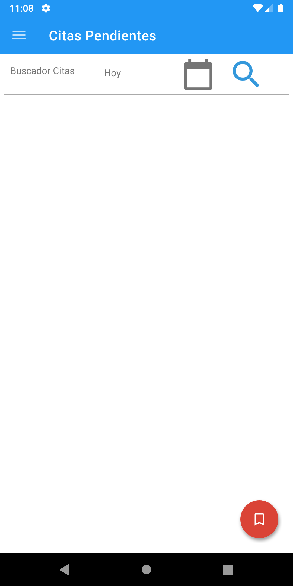
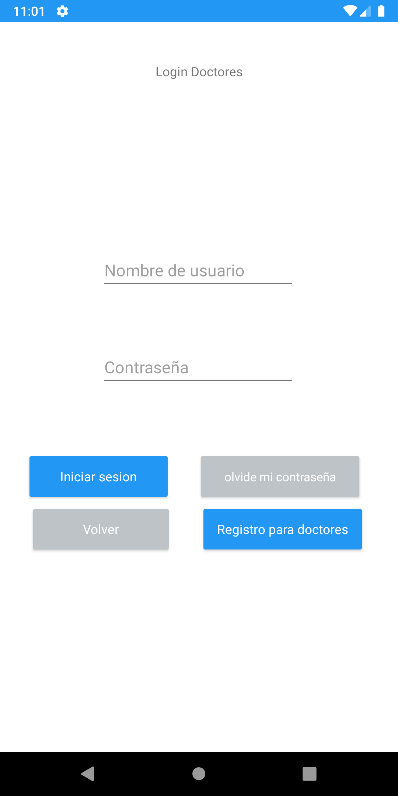
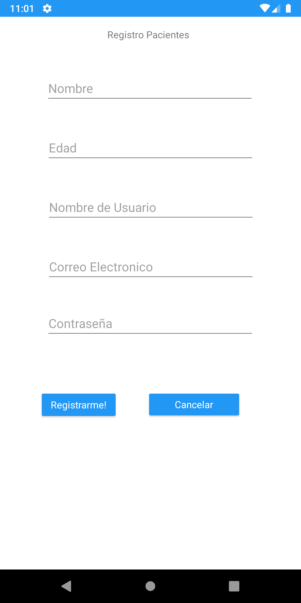

# hospital-dating-system

A proyect developed in native android, PostgresSQL and a Flask Server for a hostpital dating system 

Screenshots: 
<table>
<tr>
<td></td>
<td></td>
<td></td>
</tr>
<tr>
<td></td>
<td></td>
</tr>
</table>

## Getting Started

Just git clone and update the proyect with flutter pub get
